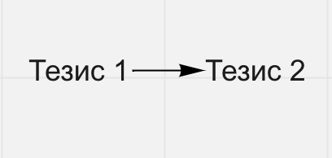
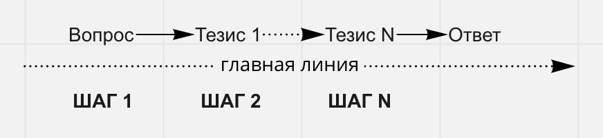
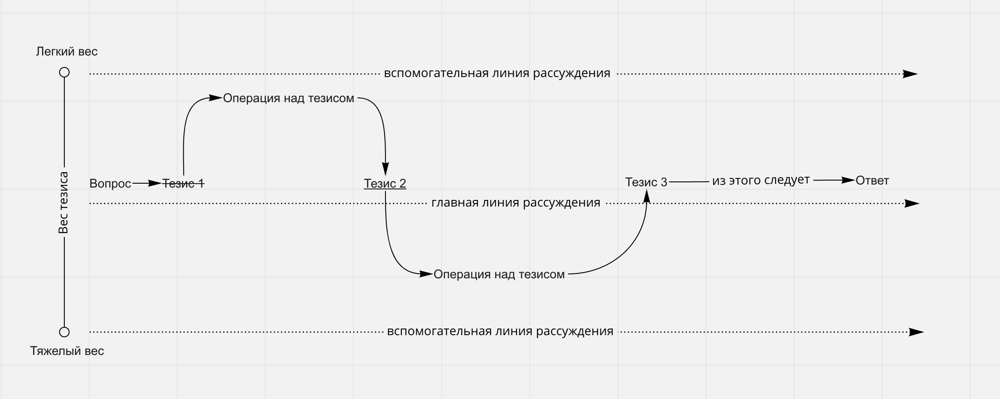

# Методология рассуждения

## Тезис
Любое рассуждение состоит из тезисов. Тезис это одна кратко написанная мысль. Любое тезис имеет свой вес. Вес тезиса определяет понятливость и точность его смысла. Одна из целей этой методологии это представить инструмент для управления весом тезиса.

## Линия рассуждения
У любого тезиса есть его главная линия. Такая линия состоит из изначального вопроса и цепочки рассуждений. Конечной точкой главной линии рассуждения является ответ на поставленный вопрос. Главная линия рассуждения может быть только одна. Все тезисы будет располагаться относительно главной линии. Любые перемещения по главной линии можно называть шагами. Также существуют вспомогательные линии рассуждения, на которые можно выйти при помощи операций над тезисами. Число вспомогательных линий рассуждения следует определять заранее заранее.

## Вес тезиса
Тезис или его части могут быть тяжелыми или легкими. Основная задача следить за весом тезиса не допуская того чтобы его части становилось слишком легким или тяжелым. Вес тезиса субъективен и относителен от того кто рассуждает над ним. Рассуждать над тезисом может быть как отдельный человек так и группа.

Тяжелые тезисы состоит из спецтерминов либо слова имеют несколько трактовок. Такой тезис вмещает в себя много лишней информации, с ним трудно работать и запоминать. Чтобы облегчить тезис нужно получать из терминов нужные смыслы и заменять ими сам термин. Либо уточнять трактования до того момента пока они не станут достаточно понятными для работы.

Легкие тезисы имеют много лишних слов не относящийся к смыслу тезиса. Либо такие тезисы имеют много текста который можно убрать без потери основного смысла. Легкий тезис может быть противоречивым иметь взаимоисключающие смыслы. Чтобы легкие тезисы становились тяжелее, нужно сокращать лишнее и сводить множество слов к одному(вводить термин) либо просто убирать все ненужное с тезиса.

## Операции тезиса
Любая работа с тезисом называется операцией. Большинство операций работают с весом тезиса. Операции с весом тезиса выводят тезис или его части на вспомогательные линии рассуждения. Операции на главной линии, называются шагами. Операции тезиса можно разделить на три типа:
Операции с облегчения тезиса. К таким операциям относиться уточнение и обьяснение.
Операции с утяжеления тезиса. К ним относятся операции сокращения слов и сведения к одному.
Операция выведения следствия. Можно проводить как на главной так и на вспомогательных линиях рассуждения.

Все сложные операции нужно проводить ниже текущей линии рассуждения, все легкие операции нужно проводить выше текущей линии тезиса. Все тяжелые операции над тезисом отмечаются подчеркиванием. Все легкие операции над тезисом отмечаются зачеркиванием.

*Типы операций* 
Уточнение тезиса
Основная задача этой операции убрать двусмысленность из слов и сделать тезис более точным.

*Объяснение термина* 
Задача этой операции это толкование спец терминов и специфических слов (например сленговых).

*Сокращение слов* 
Основная задача избавиться от ненужных слов которые размывают смысл. Убрать всю воду из текста.

*Сведение к одному* 
Основная задача свести все лишние слова к одному.

*Выведения следствий* 
Основная задача выведение следствия из тезиса по необходимости. Хоть их можно проводить на любой линии рассуждения, однако самыми важными являются те операции что проводяться на главной линии. Такие операции называются шагами.

**Как понять когда из тезиса можно вывести следствия?** 
Хороший тезис обладает оптимальным весом. Он не перегружен терминами и сложными формулировками. В таком тезисе нет лишних смыслов, либо смыслов с противоречиями. Если тяжелые тезисы можно сравнить с чем-то твердым, а легкие с чем-то летучим и газообразным. А то тезисы обладающие оптимальным весом будут похожи на жидкости и иметь свойство которое можно назвать как текучесть, то есть они могут по смыслу переходить из одного тезиса в другой.

**Для каких целей служит эта методология?** 
Основная задача методологии, организация рассуждений более рациональным образом. Когда пытаешься отвечать на поставленный вопрос, очень легко отойти от него и начать размышлять над чем-то иным. Эта методология рассчитана на те случаи, когда нужно ограничить свободу в рассуждениях и держаться поставленной цели. Вторая цель использования, это сохранять смыслы рассуждения, когда собственной памяти недостаточно. И третье это возможность перемещаться по своим тезисам и искать противоречия и ошибки.

**Какие нужные инструменты для использования методологии?** 
Методологию можно использовать как в цифровых программах, где можно рисовать карты мыслей или диаграммы, так и аналогово на бумаге или доске. Работу с рассуждением можно вести коллективно до 5ти человек, так и через ведущего.

